

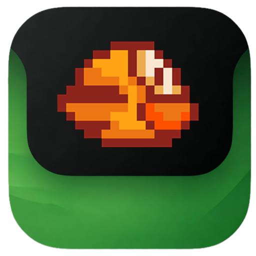

# NotchPlay

**Six hand-crafted mini-games hidden inside your MacBook's notch.**

Hover. Play. Go back to pretending you're paying attention.

---

## The Story

It was another online class. Camera off, microphone muted, the teacher talking about something I'd already stopped tracking 20 minutes ago.

I was staring at my MacBook screen when I noticed the notch - that little black cutout sitting right at the top center of the display. Everyone either ignores it or hides it. Then I found **NotchNook**, an app that turns the notch into a widget panel, and something clicked.

*What if that little black space could hide an entire arcade?*

Not widgets. Not system info. Games. Actual games you could pop open mid-meeting, play for 30 seconds, then close without anyone knowing. The notch is the perfect cover - it looks exactly the same whether the panel is open or not.

So I built it. NotchPlay is what happened when a bored student decided that the most useless piece of MacBook real estate should be the most fun.

---

## What It Does

NotchPlay lives in your MacBook's notch. No dock icon, no floating window, no menu bar clutter. Just hover over the notch and a spring-animated panel opens instantly with a full arcade inside.

Close it and it disappears - back to looking like a normal notch.

- **Zero interruption** - opens and closes in milliseconds
- **No dock icon** - completely invisible when not in use
- **Haptic feedback** - your MacBook actually vibrates on game events
- **Launch at login** - always ready, never in the way
- **No internet required** - plays fully offline, no telemetry

---

## The Arcade

Six games, each built from scratch with smooth animations and native SwiftUI physics.

 

<table>
  <tr>
    <td align="center" width="33%">
      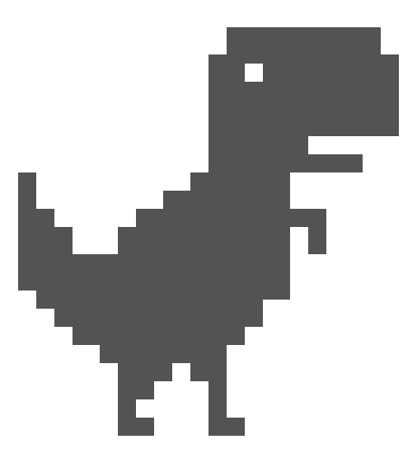 
      <b>Dino Runner</b> 
      Jump over obstacles. Survive.
    </td>
    <td align="center" width="33%">
      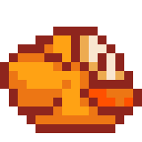 
      <b>Flappy Bird</b> 
      One tap. Infinite frustration.
    </td>
    <td align="center" width="33%">
      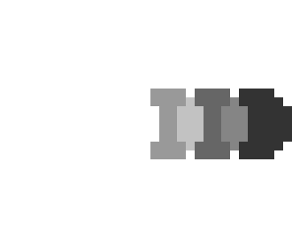 
      <b>Pong</b> 
      The original. Perfected.
    </td>
  </tr>
  <tr>
    <td align="center" width="33%">
       
      <b>Stack</b> 
      Stack perfectly. Stack forever.
    </td>
    <td align="center" width="33%">
      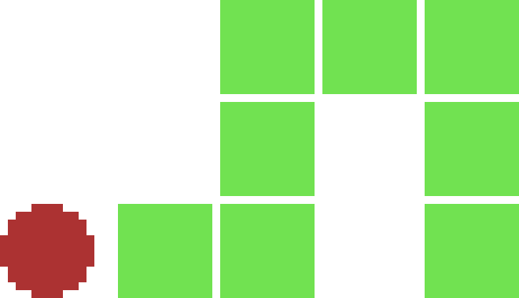 
      <b>Snake</b> 
      Eat. Grow. Don't crash.
    </td>
    <td align="center" width="33%">
      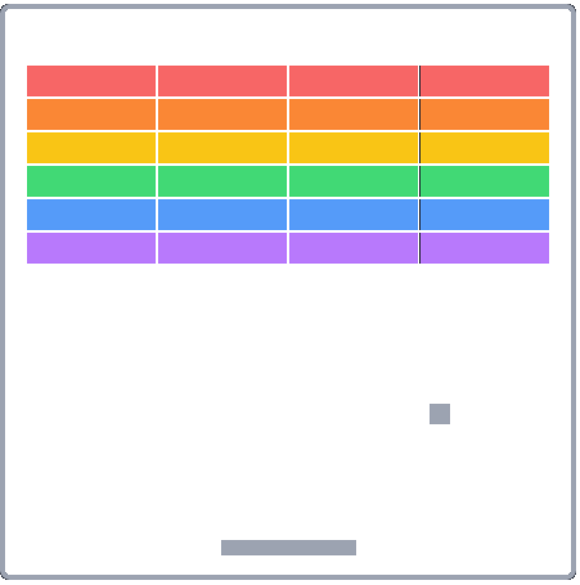 
      <b>Breakout</b> 
      Break every brick.
    </td>
  </tr>
</table>

---

## Screenshots

<table>
  <tr>
    <td>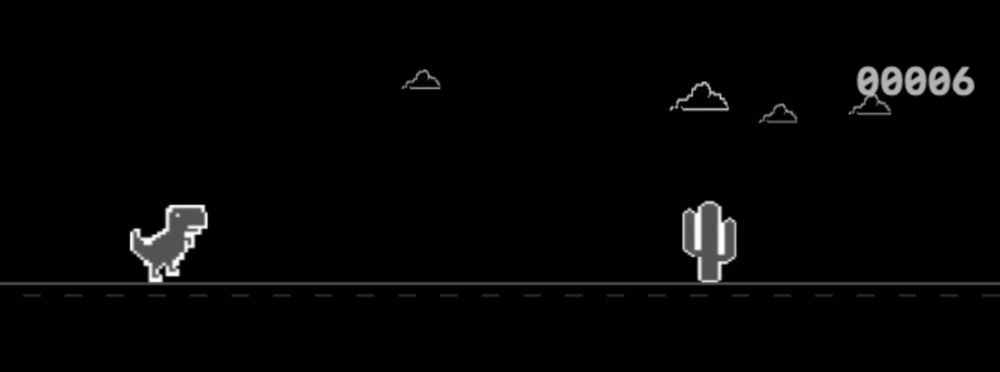</td>
    <td>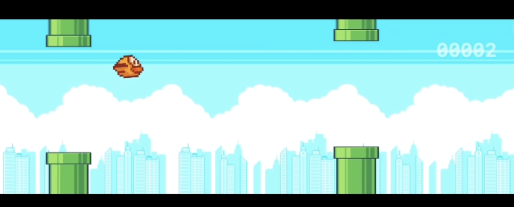</td>
    <td>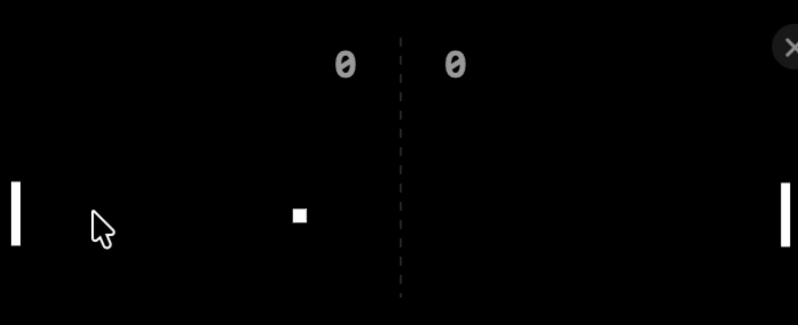</td>
  </tr>
  <tr>
    <td align="center">Dino Runner</td>
    <td align="center">Flappy Bird</td>
    <td align="center">Pong</td>
  </tr>
  <tr>
    <td>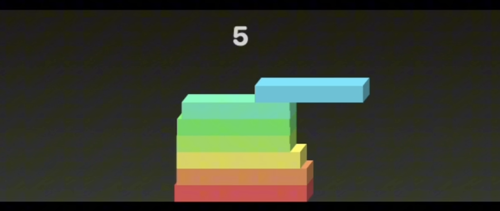</td>
    <td>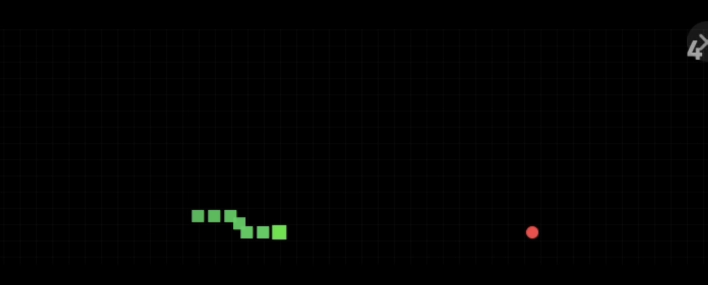</td>
    <td>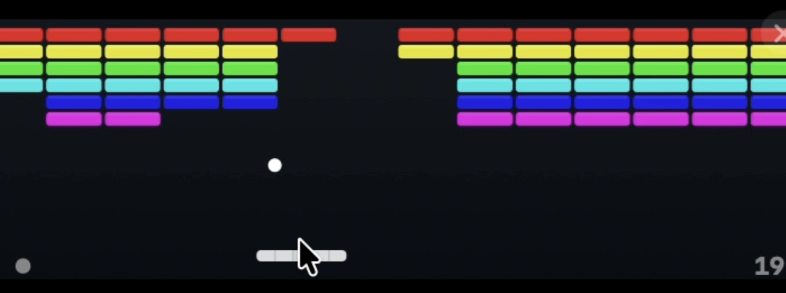</td>
  </tr>
  <tr>
    <td align="center">Stack</td>
    <td align="center">Snake</td>
    <td align="center">Breakout</td>
  </tr>
</table>

---

## Download

Head to the [**Releases**](https://github.com/YOUR_USERNAME/notchplay/releases) tab, grab the latest `.dmg`, drag NotchPlay to your Applications folder, and launch it.

That's it. Hover your cursor over the notch and start playing.

**Requirements:**
- macOS 14 Sonoma or later
- MacBook with a notch (MacBook Pro 2021+, MacBook Air M2+)
- Apple Silicon or Intel

---

## How to Use

1. Launch NotchPlay - it will hide itself from the Dock automatically
2. Move your cursor to the top center of your screen, over the notch
3. The panel springs open - pick a game
4. Press `Esc` or move the cursor away to close
5. Right-click the menu bar icon for settings and shortcuts

---

Made during online classes that could have been an email.

 

**NotchPlay** - the notch finally does something useful.

